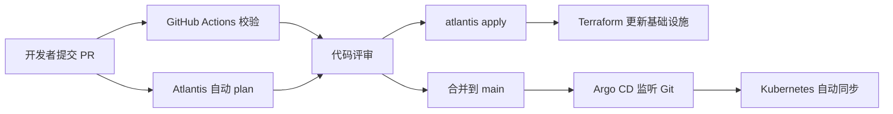

# GitHub + Argo CD + Atlantis + Terraform 自动化 CI/CD

这个仓库提供一套基础平台骨架，用于实现基础设施和应用交付自动化：

- GitHub Actions 负责 PR 校验和主分支持续集成。
- Atlantis 负责 Terraform 的 `plan`、审批和 `apply`。
- Argo CD 负责监听 Git 仓库并自动同步 Kubernetes 应用。
- Terraform 负责管理云资源、集群资源或平台依赖。

## 自动化流程



## 目录结构

```text
.github/workflows/          GitHub Actions CI 配置
atlantis/                   Atlantis 的 Kubernetes 部署清单
infra/terraform/            Terraform 环境和模块
k8s/argocd/                 Argo CD 根应用
k8s/apps/                   GitOps 应用清单
scripts/                    本地校验脚本
```

## 已包含内容

- `.github/workflows/ci.yml`
  - Terraform fmt 检查
  - Terraform init/validate
  - Kubernetes YAML schema 校验

- `.github/workflows/terraform-plan.yml`
  - Terraform PR 流程提示
  - 实际 plan/apply 交给 Atlantis 控制，避免 GitHub Actions 和 Atlantis 重复抢状态锁

- `atlantis.yaml`
  - Terraform 项目定义
  - PR 自动 plan
  - apply 前要求 PR 已批准且可合并

- `atlantis/`
  - Atlantis Deployment、Service、Ingress、ConfigMap、Secret 模板

- `k8s/argocd/root-app.yaml`
  - Argo CD app-of-apps 根应用

- `k8s/apps/sample-app/`
  - 示例 Kubernetes 应用，由 Argo CD 自动同步

- `infra/terraform/envs/dev/`
  - Terraform dev 环境示例

## GitHub Secrets

在 GitHub 仓库或组织级别配置：

| Secret | 用途 |
| --- | --- |
| `ATLANTIS_GH_TOKEN` | Atlantis 访问 GitHub 的 token |
| `ATLANTIS_WEBHOOK_SECRET` | GitHub webhook 和 Atlantis 之间的密钥 |
| `TF_API_TOKEN` | 如果使用 Terraform Cloud，可配置该 token |
| `CLOUD_PROVIDER_CREDENTIALS` | 云厂商凭据，例如 AWS、GCP、Azure 或阿里云 |

## 启动顺序

1. 准备 Kubernetes 集群。
2. 安装 Argo CD：

   ```sh
   kubectl create namespace argocd
   kubectl apply -n argocd -f https://raw.githubusercontent.com/argoproj/argo-cd/stable/manifests/install.yaml
   ```

3. 替换仓库占位符：

   - `github.com/njxz/argo-check`
   - `https://github.com/njxz/argo-check.git`
   - `atlantis.example.com`
   - `atlantis/secret.yaml` 中的 `replace-me`

4. 应用 Argo CD 根应用：

   ```sh
   kubectl apply -f k8s/argocd/root-app.yaml
   ```

5. 部署 Atlantis：

   ```sh
   kubectl apply -k atlantis
   ```

6. 配置 GitHub webhook：

   - Payload URL: `https://ATLANTIS_HOST/events`
   - Content type: `application/json`
   - Secret: 与 `ATLANTIS_WEBHOOK_SECRET` 一致
   - Events: pull requests、issue comments、pushes

## PR 使用方式

修改 `infra/terraform` 后打开 PR，Atlantis 会自动执行 plan。也可以在 PR 评论中手动触发：

```text
atlantis plan
atlantis apply
```

修改 `k8s/apps` 后合并到 `main`，Argo CD 会自动同步到 Kubernetes。

## 本地校验

```sh
./scripts/validate.sh
```

本地需要安装：

- `terraform`
- 可选：`kubeconform`

如果使用本仓库内的本地 Terraform，可直接运行：

```sh
.tools/terraform/terraform version
./scripts/validate.sh
```

## Argo 测试 Pipeline

`argo/file-check-pipeline.yaml` 是一个最小测试流水线，用于检查当前仓库文件结构和 Terraform 配置。

当前仓库地址已配置为：

```text
https://github.com/njxz/argo-check.git
```

### 本地 k3s + Argo Workflows

Mac 上不能直接原生运行 k3s，推荐用 `k3d` 在 Docker runtime 里运行 k3s。仓库提供了启动脚本：

```sh
./scripts/bootstrap-k3d-argo.sh
```

脚本会执行：

- 安装/检查 `docker`、`colima`、`kubectl`、`k3d`、`argo`
- 启动 Colima Docker runtime
- 创建 `k3d-argo-check` 本地 k3s 集群
- 安装 Argo Workflows
- 提交 `argo/file-check-pipeline.yaml`

也可以手动运行：

```sh
colima start --cpu 2 --memory 4
k3d cluster create argo-check --agents 1
kubectl create namespace argo
kubectl apply -n argo -f https://github.com/argoproj/argo-workflows/releases/latest/download/install.yaml
kubectl wait --for=condition=available deployment --all -n argo --timeout=180s
argo submit argo/file-check-pipeline.yaml -n argo --watch
```

### GitHub Actions

GitHub Actions 已配置在 `.github/workflows/ci.yml`，会在 PR 和 `main` 分支 push 时检查：

- Terraform fmt
- Terraform init/validate
- Kubernetes、Atlantis、Argo YAML schema

### PR 评论触发 Argo

`.github/workflows/argo-deploy-comment.yml` 支持在 PR 里评论：

```text
argo deploy file-check-pipeline
/argo deploy file-check-pipeline
```

它会解析为：

```text
argo/file-check-pipeline.yaml
```

然后把该 Workflow 提交到 Argo，并把参数覆盖为当前 PR 的仓库和 commit SHA：

- `repo`: PR head repo clone URL
- `revision`: PR head SHA

默认 runner 是 `self-hosted`，适合连接本机 k3d/k3s。也可以在 GitHub Actions repository variables 中设置：

```text
ARGO_RUNNER=ubuntu-latest
```

如果使用 GitHub 托管 runner，需要额外配置 repository secret：

```text
ARGO_KUBECONFIG_B64
```

生成方式：

```sh
base64 -i ~/.kube/config | pbcopy
```
